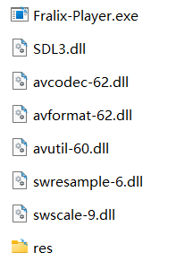
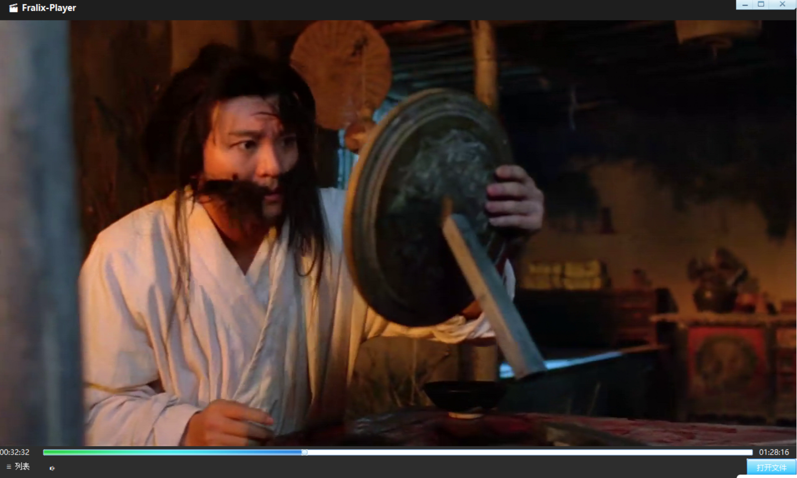

# Fralix‑Player
Self‑developed Windows media player, based on Duilib + FFmpeg + SDL3

**English** | [简体中文](README.zh.md)

## Features
- FFmpeg media decode V8.1.2
- SDL3 audio output  V3.4.14
- Duilib UI

## Introduce

### Runtime Directory Structure


### play video


### Join the Project
- If you are interested in contributing, feel free to contact "qazwsxwtc@aliyun.com" to submit your source‑code contributions.

### Quick Start
- download ffmpeg 
	https://github.com/FFmpeg/FFmpeg/releases/tag/n8.1.2
	https://www.gyan.dev/ffmpeg/builds/packages/ffmpeg-8.1.2-full_build.7z

- download SDL3 
	https://github.com/libsdl-org/SDL/releases   
	SDL3-devel-3.4.14-VC.zip
	
- download duilib git 
	https://github.com/duilib/duilib.git

- Copy all library files under the dll directory and the entire res folder to the runtime directory of Fralix‑Player.exe
-   Directory structure:
--   Fralix-Player
--   xxx.dll
--   res

```bash
git clone https://github.com/qazwsxwtc/Fralix‑Player.git
cd Fralix‑Player/src

make build
cd build
cmake .. -G "Visual Studio 17 2022"


# VS2022 x64 compile